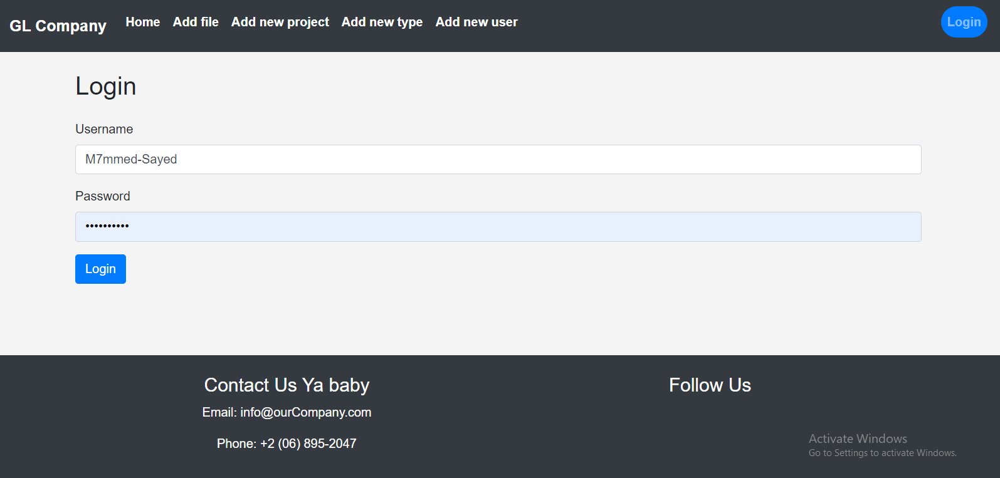
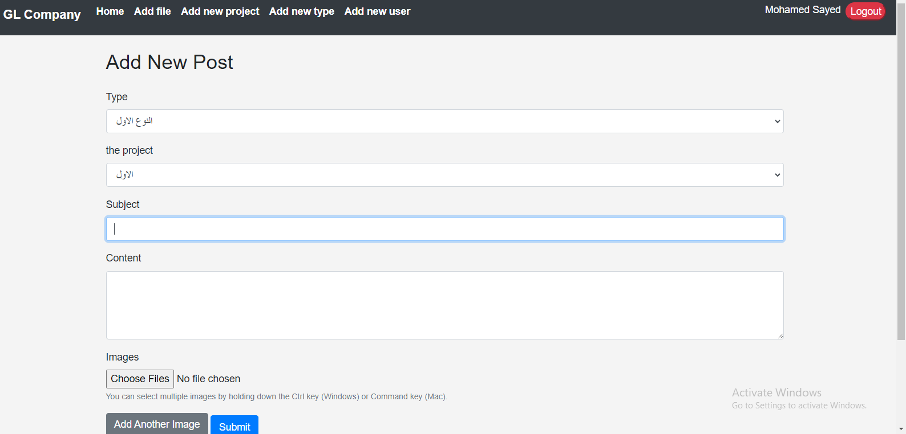
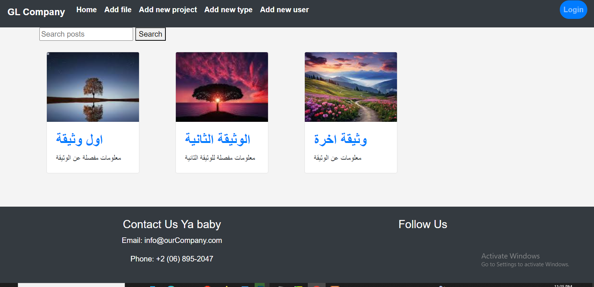
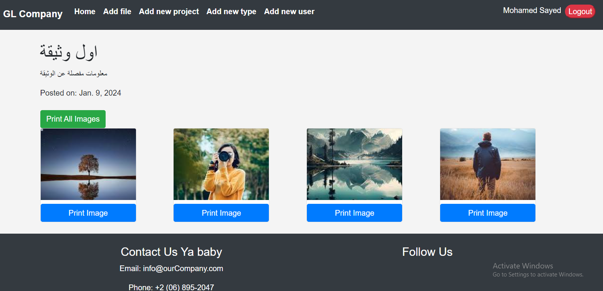

# Project company2024 Readme

## Project Overview

This Django project is designed to manage posts / documents for a company. It includes user authentication (sign in/sign out), adding posts, associating posts with project names, linking posts with post types, linking posts with users, and allowing users to view and print online documents with multiple associated images.

## Setup

1. **Clone the Repository:**
    ```bash
    git clone https://github.com/m7mmed-sayed/company2024.git
    cd company2024
    ```

2. **Install Dependencies:**
    ```bash
    pip install -r requirements.txt
    ```

3. **Database Setup and Statics:**
    - Create a MySQL database for the project.
    - Update the `DATABASES` settings in `settings.py` with your MySQL credentials.

    ```python
   MEDIA_URL = '/media/'
   MEDIA_ROOT = os.path.join(BASE_DIR, 'static', 'media')

    DATABASES = {
        'default': {
            'ENGINE': 'django.db.backends.mysql',
            'NAME': 'your_database_name',
            'USER': 'root',#to use default user
            'PASSWORD': '',#to use default pass
            'HOST': 'localhost',
            'PORT': '3306',
        }
    }
    ```

4. **Apply Migrations:**
    ```bash
    python manage.py migrate
    ```
5. **Create Superuser:**
    ```bash
    python manage.py createsuperuser
    ```

6. **Run Development Server:**
    ```bash
    python manage.py runserver
    ```

    Visit [http://127.0.0.1:8000/](http://127.0.0.1:8000/) to access the application.

## Project Features

### 1. Sign In / Sign Out

- Users can sign in using their credentials.
- Signed-in users can sign out when they are done.

### 2. Add Post

- Users can add new posts containing information about a company's activities.
- Each post can have multiple associated images describing the documented activity.

### 3. Add Project Name

- Users can associate posts with specific project names.

### 3. Add post/document type

- Users can associate post with specific document-type code.

### 4. Link Post Type with Project Type and User

- Posts are linked to post types to categorize them.
- Posts are associated with project types.
- Posts are linked to the user who created them.

### 5. View and Print Online Documents

- Internal users can log in and access the post or document files for specific companies.
- Users can navigate between posts and documents.
- Users can search or filter by post Name.
- Users can view online images/files associated with the posts.
- Options are available to print images individually or print all directly.

## Usage

1. **Sign In:**
    - Visit the application and sign in using your credentials.
2. **Add a Post-typ:**
    - Navigate to the "Add Post-type" section and provide the necessary details.
3. **Add a project Name:**
    - Navigate to the "Add project" section and provide the necessary details.
4. **Add a Post:**
    - Navigate to the "Add Post" section and provide the necessary details.
    - Upload images to describe the documented activity.

5. **Associate Project Name:**
    - When adding a post, associate it with a project name.

6. **Link Post Type, Project Type, and User:**
    - Posts are automatically linked to post types and project types.
    - The user who creates the post is automatically linked to it.

7. **View and Print Online Documents:**
    - Internal users can navigate to the post or document files for specific companies.
    - Users can view online images/files associated with the posts.
    - Options are available to print images individually or print all directly.

## Screenshots

### Sign In


### Add Post


### Home


### Detail Post



## Admin Interface

- Access the Django admin interface at [http://127.0.0.1:8000/admin/](http://127.0.0.1:8000/admin/) to manage users, posts, and other entities.

